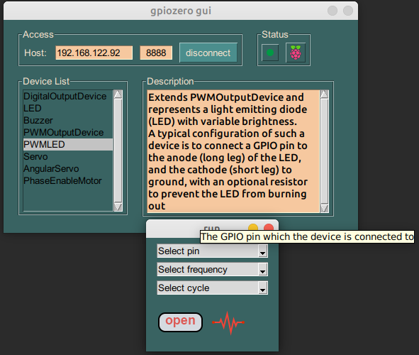

## gpiozero-gui

**quick test for different device on raspberry pi**

## prepare

[Configuring Remote GPIO](https://gpiozero.readthedocs.io/en/stable/remote_gpio.html)

## usage

`pip install -r requirement.py`
`python main.py`

and you can use **PyInstaller freezes (packages) Python applications into stand-alone executables**

## todo
- Style optimize
- Input device
- SPI device

 
  Visitor count 
  

